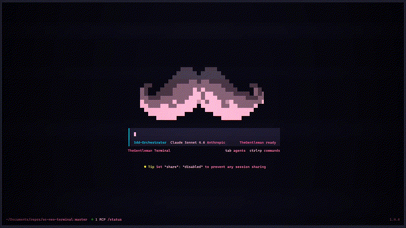

# Neo-Terminal for OpenCode

A Neo-terminal personality matrix for OpenCode — CRT scanlines, retro-futuristic themes, neural effects, and a multi-agent dashboard.


This is a **monorepo** containing both the plugin (functionality) and themes (visual styles).

## Structure

```
oc-neo-terminal/
├── packages/
│   ├── plugin/              # oc-neo-terminal - Visual effects & commands
│   └── themes/
│       ├── neo-rose/        # Neon pink + cyan + violet
│       ├── neo-matrix/      # Green with teal, lime, and violet
│       ├── neo-amber/       # Amber phosphor with gold, coral, olive
│       └── neo-cyan/        # Cyan with electric blue and magenta
```

## Features

### Neural Command

Type `/neural` to trigger a pulsating brain animation with glitch effects:


### Sidebar Dashboard

NEXUS-style monitoring dashboard with custom ASCII art sidebar:


## Themes

Four themes with distinct multi-color palettes — each syntax role (keywords, functions, strings, etc.) has its own color for instant visual parsing.

### neo-rose (default)

Neon pink + cyan + violet accents on dark void.


### neo-matrix

Classic green with teal, lime neon, and violet accents.


### neo-amber

Vintage amber phosphor with gold, coral, and olive accents.


### neo-cyan

Futuristic cyan with electric blue and magenta accents.


## Customization

You can customize the brand name and ASCII art. Here's the default NEXUS branding replaced with a custom logo:



Create files in `~/.config/opencode/oc-neo-terminal/`:

### `brand.json`

```json
{
  "name": "CYBER-1",
  "home": "home.txt"
}
```

- **`name`** — Brand name displayed in the UI (max 20 chars). Defaults to `NEXUS`.
- **`home`** — Fallback ASCII art file used for all home sizes when a specific size file doesn't exist.

### ASCII Art Files

Place `.txt` files in `~/.config/opencode/oc-neo-terminal/`:

| File              | Purpose                                                        |
| ----------------- | -------------------------------------------------------------- |
| `home-small.txt`  | Logo for terminals smaller than ~15 rows (default: 5 rows)     |
| `home-medium.txt` | Logo for medium terminals ~15-30 rows (default: 31 rows)       |
| `home-large.txt`  | Logo for large terminals >30 rows (default: 29 rows)           |
| `side.txt`        | Sidebar icon that appears on the left panel (default: 11 rows) |

### Resolution Priority

For each home size, the plugin resolves the ASCII art in this order:

1. **Specific file** — e.g. `home-medium.txt` if it exists
2. **`home` fallback** — the file specified in `brand.json` `"home"` field
3. **Built-in default** — the NEXUS ASCII art hardcoded in the plugin

**Example**: If `brand.json` has `"home": "home.txt"` and only `home.txt` exists, that file is used for small, medium, **and** large sizes. If you later create `home-large.txt`, it takes priority for the large size while `home.txt` still covers small and medium.

## Installation

### Step 1: Clone the repository

```bash
cd ~/.config/opencode
git clone https://github.com/NelsonAguirre/oc-neo-terminal.git
```

Or clone anywhere and use the full path.

### Step 2: Install the themes

Symlink or copy the theme files to the OpenCode themes directory:

```bash
# Create symlinks (recommended for development)
ln -s ~/Documents/repos/oc-neo-terminal/packages/themes/*/themes/*.json ~/.config/opencode/themes/

# Or copy them
cp packages/themes/*/themes/*.json ~/.config/opencode/themes/
```

### Step 3: Configure OpenCode

Edit your `~/.config/opencode/tui.json`:

```json
{
  "$schema": "https://opencode.ai/tui.json",
  "theme": "neo-rose",
  "plugin": ["~/.config/opencode/oc-neo-terminal-dev/packages/plugin"]
}
```

> **Note:** Use the `-dev` symlink path for development. For production installs, use the direct repo path.

### Quick Start (Recommended)

Both theme and plugin together:

```json
{
  "$schema": "https://opencode.ai/tui.json",
  "theme": "neo-rose",
  "plugin": ["~/.config/opencode/oc-neo-terminal-dev/packages/plugin"]
}
```

### Plugin Only

If you want the neo-terminal effects with a different theme:

```json
{
  "plugin": ["~/.config/opencode/oc-neo-terminal-dev/packages/plugin"]
}
```

### Theme Only

If you just want the themes without effects:

```json
{
  "theme": "neo-rose"
}
```

## Packages

### Plugin (`packages/plugin/`)

The plugin provides:
- **Holographic Scanlines**: Retro-futuristic CRT effect
- **Neural Command**: `/neural` triggers a pulsating brain animation
- **Vignette Effect**: Dark corners for immersive focus
- **Side Panel**: NEXUS-style monitoring dashboard
- **Customizable Brand**: Configure your own ASCII art and brand name

See [packages/plugin/README.md](packages/plugin/README.md) for plugin-specific docs.

### Themes (`packages/themes/`)

#### Available Themes

- **`neo-rose`** (default) - Neon pink + cyan + violet accents on dark void
- **`neo-matrix`** - Classic green with teal, lime neon, and violet accents
- **`neo-amber`** - Vintage amber phosphor with gold, coral, and olive accents
- **`neo-cyan`** - Futuristic cyan with electric blue and magenta accents

See individual theme READMEs for details.

## Development

This is a local monorepo. No npm publish needed.

To work on a specific package:

```bash
cd packages/plugin
# or
cd packages/themes/neo-rose
```

To update after pulling changes:

```bash
git pull
```

## Development Workflow with Symlinks

For development, create symlinks so changes are reflected instantly:

```bash
# Symlink the repo
cd ~/.config/opencode
ln -s ~/Documents/repos/oc-neo-terminal oc-neo-terminal-dev

# Symlink themes
ln -s ~/Documents/repos/oc-neo-terminal/packages/themes/*/themes/*.json themes/
```

Then in `tui.json`:

```json
{
  "theme": "neo-rose",
  "plugin": ["~/.config/opencode/oc-neo-terminal-dev/packages/plugin"]
}
```

## License

MIT