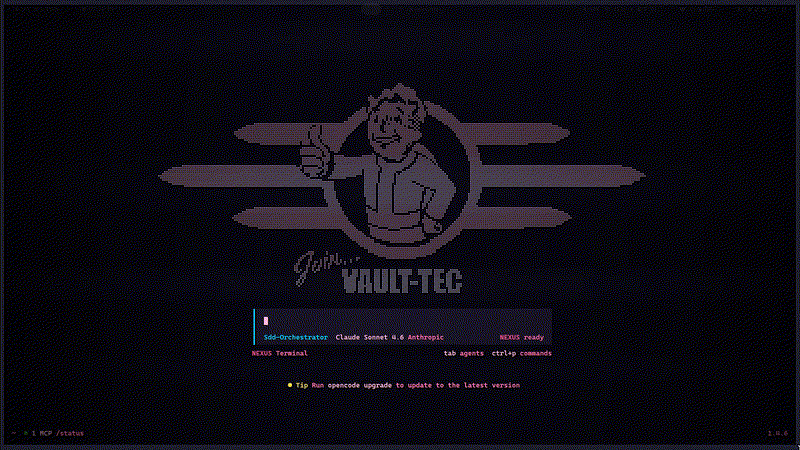
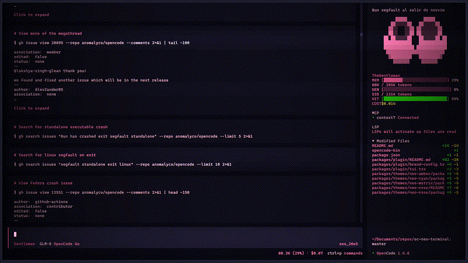
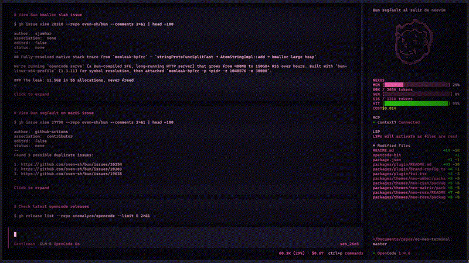

# Neo-Terminal for OpenCode

A Neo-terminal personality matrix for OpenCode — CRT scanlines, retro-futuristic themes, neural effects, and a multi-agent dashboard.



This is a **monorepo** containing both the plugin (functionality) and themes (visual styles).

## Structure

```
oc-neo-terminal/
├── packages/
│   ├── plugin/              # oc-neo-terminal - Visual effects & commands
│   └── themes/
│       ├── neo-rose.json    # Neon pink + cyan + violet
│       ├── neo-matrix.json  # Green with teal, lime, and violet
│       ├── neo-amber.json   # Amber phosphor with gold, coral, olive
│       └── neo-cyan.json    # Cyan with electric blue and magenta
```

## Features

### Neural Command

Type `/neural` to trigger a pulsating brain animation with glitch effects:


### Sidebar Dashboard

NEXUS-style monitoring dashboard with custom ASCII art sidebar:



_Sidebar ASCII based on [plugin-gentleman](https://github.com/IrrealV/plugin-gentleman) by IrrealV._

## Themes

Four themes with distinct multi-color palettes — each syntax role (keywords, functions, strings, etc.) has its own color for instant visual parsing.

### neo-rose (default)

Neon pink + cyan + violet accents on dark void.

    



### neo-matrix

Classic green with teal, lime neon, and violet accents.

   


### neo-amber

Vintage amber phosphor with gold, coral, and olive accents.

   


### neo-cyan

Futuristic cyan with electric blue and magenta accents.

   


## Customization

You can customize the brand name and ASCII art. Here's an example using **"TheGlentleman"** as the brand name with custom ASCII art:


_Home ASCII based on [Gentleman.Dots](https://github.com/Gentleman-Programming/Gentleman.Dots) by Gentleman Programming._

Create files in `~/.config/opencode/oc-neo-terminal/`:

### `brand.json`

```json
{
  "name": "CYBER-1",
  "home": "home.txt"
}
```

- **`name`** — Brand name displayed in the UI (max 20 chars). Defaults to `NEXUS`.
- **`home`** — Fallback ASCII art file used for all home sizes when a specific size file doesn't exist.

### ASCII Art Files

Place `.txt` files in `~/.config/opencode/oc-neo-terminal/`:

| File              | Purpose                                                        |
| ----------------- | -------------------------------------------------------------- |
| `home-small.txt`  | Logo for terminals smaller than ~15 rows (default: 5 rows)     |
| `home-medium.txt` | Logo for medium terminals ~15-30 rows (default: 31 rows)       |
| `home-large.txt`  | Logo for large terminals >30 rows (default: 29 rows)           |
| `side.txt`        | Sidebar icon that appears on the left panel (default: 11 rows) |

### Resolution Priority

For each home size, the plugin resolves the ASCII art in this order:

1. **Specific file** — e.g. `home-medium.txt` if it exists
2. **`home` fallback** — the file specified in `brand.json` `"home"` field
3. **Built-in default** — the NEXUS ASCII art hardcoded in the plugin

**Example**: If `brand.json` has `"home": "home.txt"` and only `home.txt` exists, that file is used for small, medium, **and** large sizes. If you later create `home-large.txt`, it takes priority for the large size while `home.txt` still covers small and medium.

## Installation

### Quick Start

Add the plugin to your `tui.json` config:

```json
{
  "$schema": "https://opencode.ai/tui.json",
  "plugin": ["@nelsonaguirre/oc-plugin-neo-terminal"]
}
```

OpenCode will automatically install the plugin from npm.

> **Note:** The theme must be installed separately. See [Themes Only](#themes-only) below.

### Global Installation

Install globally using OpenCode CLI:

```bash
opencode plugin @nelsonaguirre/oc-plugin-neo-terminal -g
```

### Local Installation

For local installation in your config folder:

```bash
opencode plugin @nelsonaguirre/oc-plugin-neo-terminal
```

### Themes Only

If you only want the themes (without plugin effects), copy or symlink the theme JSONs:

```bash
# Symlink (recommended for easy updates)
ln -s ~/Documents/repos/oc-neo-terminal/packages/themes/*.json ~/.config/opencode/themes/

# Or copy
cp ~/Documents/repos/oc-neo-terminal/packages/themes/*.json ~/.config/opencode/themes/
```

Then configure the theme:

```json
{
  "theme": "neo-rose"
}
```

## Configuration Options

The plugin supports the following configuration options in `tui.json`:

```json
{
  "$schema": "https://opencode.ai/tui.json",
  "theme": "neo-rose",
  "plugin": [
    [
      "@nelsonaguirre/oc-plugin-neo-terminal",
      {
        "enabled": true,
        "scanlines": true,
        "scanline_speed": 0.008,
        "vignette": 0.65,
        "sidebar": true
      }
    ]
  ]
}
```

### Available Options

| Option           | Type      | Default | Description                                              |
| ---------------- | --------- | ------- | -------------------------------------------------------- |
| `enabled`        | `boolean` | `true`  | Enable/disable the plugin entirely                       |
| `scanlines`      | `boolean` | `true`  | Show holographic CRT scanline effect                     |
| `scanline_speed` | `number`  | `0.008` | Animation speed of scanlines (0-1, higher = faster)      |
| `vignette`       | `number`  | `0.65`  | Corner darkness intensity (0-1, higher = darker corners) |
| `sidebar`        | `boolean` | `true`  | Show the NEXUS-style side panel with system metrics      |

### Examples

**Disable scanlines but keep vignette and sidebar:**

```json
{
  "plugin": [
    [
      "@nelsonaguirre/oc-plugin-neo-terminal",
      {
        "scanlines": false,
        "vignette": 0.8
      }
    ]
  ]
}
```

**Minimal mode (no effects, no sidebar):**

```json
{
  "plugin": [
    [
      "@nelsonaguirre/oc-plugin-neo-terminal",
      {
        "scanlines": false,
        "vignette": 0,
        "sidebar": false
      }
    ]
  ]
}
```

**Fast scanlines with strong vignette:**

```json
{
  "plugin": [
    [
      "@nelsonaguirre/oc-plugin-neo-terminal",
      {
        "scanline_speed": 0.02,
        "vignette": 0.9
      }
    ]
  ]
}
```

## Acknowledgments

This project builds upon the foundation of **[oc-plugin-vault-tec](https://github.com/kommander/oc-plugin-vault-tec)** by [kommander](https://github.com/kommander) — the base codebase, Fallout ASCII art, and green theme concept that made this possible.

### Custom ASCII Art Credits

- **Home screen example**: Adapted from [Gentleman.Dots](https://github.com/Gentleman-Programming/Gentleman.Dots) by [Gentleman Programming](https://github.com/Gentleman-Programming).
- **Sidebar example**: Adapted from [plugin-gentleman](https://github.com/IrrealV/plugin-gentleman) by [IrrealV](https://github.com/IrrealV).

## License

MIT

